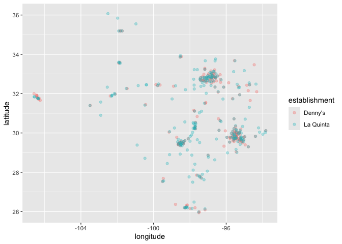

Lab 04 - La Quinta is Spanish for next to Denny’s, Pt. 1
================
George Nesbitt
02/03/2026

### Load packages and data

``` r
library(tidyverse) 
library(dsbox) 
```

``` r
states <- read_csv("data/states.csv")
```

``` r
states <- read_csv("data/states.csv")
```

    ## Rows: 51 Columns: 3
    ## ── Column specification ────────────────────────────────────────────────────────
    ## Delimiter: ","
    ## chr (2): name, abbreviation
    ## dbl (1): area
    ## 
    ## ℹ Use `spec()` to retrieve the full column specification for this data.
    ## ℹ Specify the column types or set `show_col_types = FALSE` to quiet this message.

### Exercise 1

``` r
glimpse(dennys)
```

    ## Rows: 1,643
    ## Columns: 6
    ## $ address   <chr> "2900 Denali", "3850 Debarr Road", "1929 Airport Way", "230 …
    ## $ city      <chr> "Anchorage", "Anchorage", "Fairbanks", "Auburn", "Birmingham…
    ## $ state     <chr> "AK", "AK", "AK", "AL", "AL", "AL", "AL", "AL", "AL", "AL", …
    ## $ zip       <chr> "99503", "99508", "99701", "36849", "35207", "35294", "35056…
    ## $ longitude <dbl> -149.8767, -149.8090, -147.7600, -85.4681, -86.8317, -86.803…
    ## $ latitude  <dbl> 61.1953, 61.2097, 64.8366, 32.6033, 33.5615, 33.5007, 34.206…

There are 1,643 rows in the Denny’s dataset. These are each location.
There are 6 columns in each data set. These are the variables address,
city, state, zip code, longitutde and latitude.

### Exercise 2

``` r
glimpse(laquinta)
```

    ## Rows: 909
    ## Columns: 6
    ## $ address   <chr> "793 W. Bel Air Avenue", "3018 CatClaw Dr", "3501 West Lake …
    ## $ city      <chr> "\nAberdeen", "\nAbilene", "\nAbilene", "\nAcworth", "\nAda"…
    ## $ state     <chr> "MD", "TX", "TX", "GA", "OK", "TX", "AG", "TX", "NM", "NM", …
    ## $ zip       <chr> "21001", "79606", "79601", "30102", "74820", "75254", "20345…
    ## $ longitude <dbl> -76.18846, -99.77877, -99.72269, -84.65609, -96.63652, -96.8…
    ## $ latitude  <dbl> 39.52322, 32.41349, 32.49136, 34.08204, 34.78180, 32.95164, …

There are 909 rows that represent the locations of each location. There
are 6 columns which represent the variables address, city, state,
zipcode, longitude and latitude

### Exercise 3

There are La Quinta locations in Canada, Mexico, China, New Zealand,
Georgia (the country), Turkiye, UAE, Colombia and Ecuador.

There are Denny’s locations in Canada, El Salvador, Indonesia,
Phillipines, Chile, Guam, Japan, Costa Rica, Guatemala, Mexico, UAE,
Curacao, Honduras, New Zealand and the UK.

### Exercise 4

I think potentially one way to figure out whether there are locations in
different countries using only the data would be to filter data by
longitude and latitude. If you could filter in any values for either
that don’t run through United States territory, you would know those
Denny’s are not American locations.

### Exercise 5

``` r
dennys %>%
  filter(!(state %in% states$abbreviation))
```

    ## # A tibble: 0 × 6
    ## # ℹ 6 variables: address <chr>, city <chr>, state <chr>, zip <chr>,
    ## #   longitude <dbl>, latitude <dbl>

There are not any Denny’s locations outside the US in this dataset

### Exercise 6

``` r
dennys %>%
  mutate(country = "United States")
```

    ## # A tibble: 1,643 × 7
    ##    address                        city    state zip   longitude latitude country
    ##    <chr>                          <chr>   <chr> <chr>     <dbl>    <dbl> <chr>  
    ##  1 2900 Denali                    Anchor… AK    99503    -150.      61.2 United…
    ##  2 3850 Debarr Road               Anchor… AK    99508    -150.      61.2 United…
    ##  3 1929 Airport Way               Fairba… AK    99701    -148.      64.8 United…
    ##  4 230 Connector Dr               Auburn  AL    36849     -85.5     32.6 United…
    ##  5 224 Daniel Payne Drive N       Birmin… AL    35207     -86.8     33.6 United…
    ##  6 900 16th St S, Commons on Gree Birmin… AL    35294     -86.8     33.5 United…
    ##  7 5931 Alabama Highway, #157     Cullman AL    35056     -86.9     34.2 United…
    ##  8 2190 Ross Clark Circle         Dothan  AL    36301     -85.4     31.2 United…
    ##  9 900 Tyson Rd                   Hope H… AL    36043     -86.4     32.2 United…
    ## 10 4874 University Drive          Huntsv… AL    35816     -86.7     34.7 United…
    ## # ℹ 1,633 more rows

### Excercise 7

``` r
laquinta %>%
  filter(!(state %in% states$abbreviation))
```

    ## # A tibble: 14 × 6
    ##    address                                  city  state zip   longitude latitude
    ##    <chr>                                    <chr> <chr> <chr>     <dbl>    <dbl>
    ##  1 Carretera Panamericana Sur KM 12         "\nA… AG    20345    -102.     21.8 
    ##  2 Av. Tulum Mza. 14 S.M. 4 Lote 2          "\nC… QR    77500     -86.8    21.2 
    ##  3 Ejercito Nacional 8211                   "Col… CH    32528    -106.     31.7 
    ##  4 Blvd. Aeropuerto 4001                    "Par… NL    66600    -100.     25.8 
    ##  5 Carrera 38 # 26-13 Avenida las Palmas c… "\nM… ANT   0500…     -75.6     6.22
    ##  6 AV. PINO SUAREZ No. 1001                 "Col… NL    64000    -100.     25.7 
    ##  7 Av. Fidel Velazquez #3000 Col. Central   "\nM… NL    64190    -100.     25.7 
    ##  8 63 King Street East                      "\nO… ON    L1H1…     -78.9    43.9 
    ##  9 Calle Las Torres-1 Colonia Reforma       "\nP… VE    93210     -97.4    20.6 
    ## 10 Blvd. Audi N. 3 Ciudad Modelo            "\nS… PU    75010     -97.8    19.2 
    ## 11 Ave. Zeta del Cochero No 407             "Col… PU    72810     -98.2    19.0 
    ## 12 Av. Benito Juarez 1230 B (Carretera 57)… "\nS… SL    78399    -101.     22.1 
    ## 13 Blvd. Fuerza Armadas                     "con… FM    11101     -87.2    14.1 
    ## 14 8640 Alexandra Rd                        "\nR… BC    V6X1…    -123.     49.2

There are 14 La Quinta Locations in other countries. The countries are
Peru (AG), Mexico ()

### Excercise 8

``` r
laquinta <- laquinta %>% 
  mutate(country = case_when(
    state %in% state.abb ~ "United States",
    state %in% c("ON", "BC") ~ "Canada",
    state == "ANT" ~ "Colombia",
    state %in% c("AG","QR", "CH","NL","VE", "PU", "SL") ~ "Mexico",
    state == "FM" ~ "Honduras"
  ))
```

``` r
laquinta <- laquinta %>%
  filter(country == "United States")
```

### Excercise 9

``` r
table(dennys$state)
```

    ## 
    ##  AK  AL  AR  AZ  CA  CO  CT  DC  DE  FL  GA  HI  IA  ID  IL  IN  KS  KY  LA  MA 
    ##   3   7   9  83 403  29  12   2   1 140  22   6   3  11  56  37   8  16   4   8 
    ##  MD  ME  MI  MN  MO  MS  MT  NC  ND  NE  NH  NJ  NM  NV  NY  OH  OK  OR  PA  RI 
    ##  26   7  22  15  42   5   4  28   4   5   3  10  28  35  56  44  15  24  40   5 
    ##  SC  SD  TN  TX  UT  VA  VT  WA  WI  WV  WY 
    ##  17   3   7 200  27  28   2  49  25   3   4

Delaware Has the least amount of Denny’s. This isn’t super surprising
because it is one of the smaller states. California has the most (double
the next highest Texas)

``` r
table(laquinta$state)
```

    ## 
    ##  AK  AL  AR  AZ  CA  CO  CT  FL  GA  IA  ID  IL  IN  KS  KY  LA  MA  MD  ME  MI 
    ##   2  16  13  18  56  27   6  74  41   4  10  17  17   9  10  28   6  13   1   4 
    ##  MN  MO  MS  MT  NC  ND  NE  NH  NJ  NM  NV  NY  OH  OK  OR  PA  RI  SC  SD  TN 
    ##   7  12  12   9  12   5   5   2   5  19   8  19  17  29  10  10   2   8   2  30 
    ##  TX  UT  VA  VT  WA  WI  WV  WY 
    ## 237  12  14   2  16  13   3   3

Maine, British Columbia, Ontario, Vermont, QR, SL AG and ANT (Not sure
what Canadian state those are) have the least amount of La Quinta
Locations and Texas has the most. The least are not surprising to me and
the most is a little surprising because I thought that La Quinta was a
California brand.

``` r
dennys %>%
  count(state) %>%
  inner_join(states, by = c("state" = "abbreviation"))
```

    ## # A tibble: 51 × 4
    ##    state     n name                     area
    ##    <chr> <int> <chr>                   <dbl>
    ##  1 AK        3 Alaska               665384. 
    ##  2 AL        7 Alabama               52420. 
    ##  3 AR        9 Arkansas              53179. 
    ##  4 AZ       83 Arizona              113990. 
    ##  5 CA      403 California           163695. 
    ##  6 CO       29 Colorado             104094. 
    ##  7 CT       12 Connecticut            5543. 
    ##  8 DC        2 District of Columbia     68.3
    ##  9 DE        1 Delaware               2489. 
    ## 10 FL      140 Florida               65758. 
    ## # ℹ 41 more rows

``` r
dennys%>%
  count(state) %>%
  inner_join(states, by = c("state" = "abbreviation"))
```

    ## # A tibble: 51 × 4
    ##    state     n name                     area
    ##    <chr> <int> <chr>                   <dbl>
    ##  1 AK        3 Alaska               665384. 
    ##  2 AL        7 Alabama               52420. 
    ##  3 AR        9 Arkansas              53179. 
    ##  4 AZ       83 Arizona              113990. 
    ##  5 CA      403 California           163695. 
    ##  6 CO       29 Colorado             104094. 
    ##  7 CT       12 Connecticut            5543. 
    ##  8 DC        2 District of Columbia     68.3
    ##  9 DE        1 Delaware               2489. 
    ## 10 FL      140 Florida               65758. 
    ## # ℹ 41 more rows

``` r
dennys %>%
  count(state, name = "dennys_locations") %>% inner_join(states, by = c("state" = "abbreviation")) %>%
  mutate(dennys_per_1000_sq_miles = (dennys_locations / area) * 1000) %>%
  arrange(desc(dennys_per_1000_sq_miles))
```

    ## # A tibble: 51 × 5
    ##    state dennys_locations name                     area dennys_per_1000_sq_miles
    ##    <chr>            <int> <chr>                   <dbl>                    <dbl>
    ##  1 DC                   2 District of Columbia     68.3                   29.3  
    ##  2 RI                   5 Rhode Island           1545.                     3.24 
    ##  3 CA                 403 California           163695.                     2.46 
    ##  4 CT                  12 Connecticut            5543.                     2.16 
    ##  5 FL                 140 Florida               65758.                     2.13 
    ##  6 MD                  26 Maryland              12406.                     2.10 
    ##  7 NJ                  10 New Jersey             8723.                     1.15 
    ##  8 NY                  56 New York              54555.                     1.03 
    ##  9 IN                  37 Indiana               36420.                     1.02 
    ## 10 OH                  44 Ohio                  44826.                     0.982
    ## # ℹ 41 more rows

``` r
laquinta%>%
  count(state) %>%
  inner_join(states, by = c("state" = "abbreviation"))
```

    ## # A tibble: 48 × 4
    ##    state     n name           area
    ##    <chr> <int> <chr>         <dbl>
    ##  1 AK        2 Alaska      665384.
    ##  2 AL       16 Alabama      52420.
    ##  3 AR       13 Arkansas     53179.
    ##  4 AZ       18 Arizona     113990.
    ##  5 CA       56 California  163695.
    ##  6 CO       27 Colorado    104094.
    ##  7 CT        6 Connecticut   5543.
    ##  8 FL       74 Florida      65758.
    ##  9 GA       41 Georgia      59425.
    ## 10 IA        4 Iowa         56273.
    ## # ℹ 38 more rows

``` r
laquinta %>%
  count(state, name = "laquinta_locations") %>% inner_join(states, by = c("state" = "abbreviation")) %>%
  mutate(laquinta_per_1000_sq_miles = (laquinta_locations / area) * 1000) %>%
  arrange(desc(laquinta_per_1000_sq_miles))
```

    ## # A tibble: 48 × 5
    ##    state laquinta_locations name             area laquinta_per_1000_sq_miles
    ##    <chr>              <int> <chr>           <dbl>                      <dbl>
    ##  1 RI                     2 Rhode Island    1545.                      1.29 
    ##  2 FL                    74 Florida        65758.                      1.13 
    ##  3 CT                     6 Connecticut     5543.                      1.08 
    ##  4 MD                    13 Maryland       12406.                      1.05 
    ##  5 TX                   237 Texas         268596.                      0.882
    ##  6 TN                    30 Tennessee      42144.                      0.712
    ##  7 GA                    41 Georgia        59425.                      0.690
    ##  8 NJ                     5 New Jersey      8723.                      0.573
    ##  9 MA                     6 Massachusetts  10554.                      0.568
    ## 10 LA                    28 Louisiana      52378.                      0.535
    ## # ℹ 38 more rows

## Excercise 10

From above, the most dennys per square mile is washington DC which makes
sense due to the small area. From above, the most La Quintas per square
mile is Rhode Island which also makese sense due to the small area.

``` r
dennys <- dennys %>% mutate(establishment = "Denny's")
laquinta <- laquinta %>% mutate(establishment = "La Quinta")
```

``` r
dennys_laquinta <- bind_rows(dennys, laquinta)
```

``` r
ggplot(dennys_laquinta, mapping = aes(x = longitude,y = latitude, color = establishment
)) + geom_point()
```

<!-- --> \## Ex. 11

``` r
ggplot(
  dennys_laquinta %>% filter(state == "NC"),
  aes( x = longitude,y = latitude, color = establishment
  )
) + geom_point(alpha=.5)
```

<!-- -->

It doesn’t appear that this joke is all that accurate here in North
Carolina. \## Ex. 12

``` r
ggplot(
  dennys_laquinta %>% filter(state == "TX"),
  aes( x = longitude,y = latitude, color = establishment
  )
) + geom_point(alpha=.3)
```

<!-- -->

There are much more locations next to each other in Texas. Being from
Texas I can also tell you that all the dots are big cities and the line
from the center to the top middle is Interstate 35.

## Ex. 13

my chunks stopped loading here for some reason…
